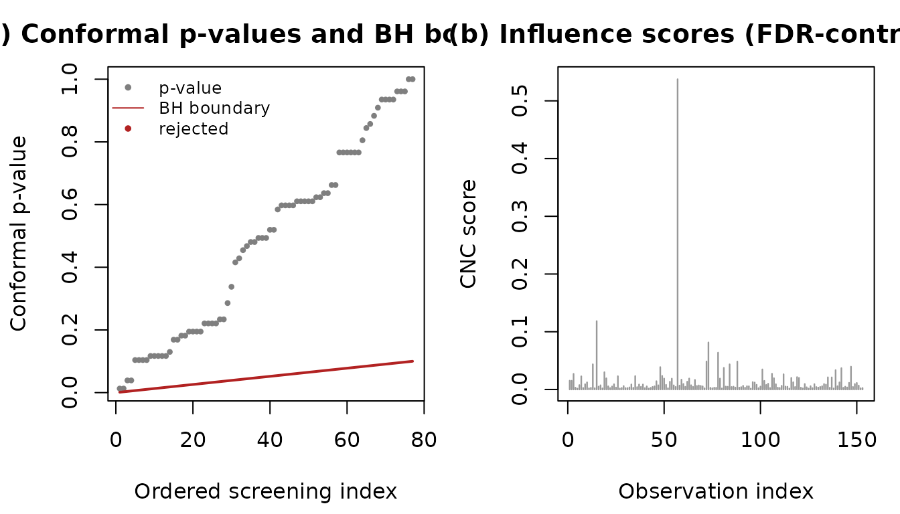
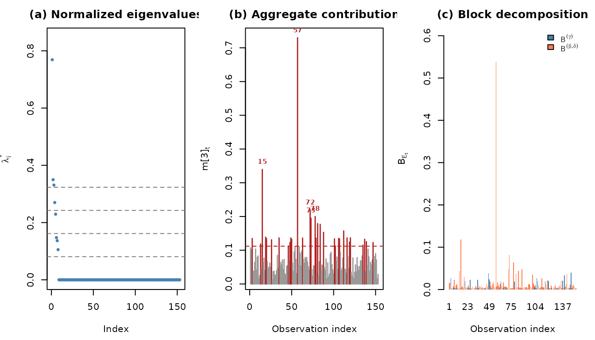
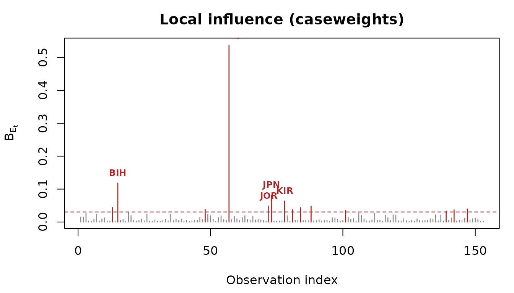

# Conformal Local Influence Screening with clis

## Motivation

Classical local influence diagnostics rank observations by a curvature
measure and ask the analyst to inspect an index plot for points that
“stand out”. This workflow has two well-known weaknesses. First, it does
not scale: with thousands of observations, the index plot becomes
unreadable and the underlying $`n \times n`$ eigenproblem becomes
expensive. Second, it offers no control of the error rate: there is no
principled threshold and no guarantee on the proportion of false
declarations.

The **clis** package addresses both problems for zero-or-one inflated
beta (BIc) regression models. It uses the conformal normal curvature of
an observation as a *non-conformity score* inside a split-conformal
testing procedure. The result is a per-observation conformal $`p`$-value
whose Benjamini-Hochberg adjustment controls the false discovery rate
(FDR) at a level you choose, while running in linear time per
observation after a single model fit.

## A worked example

We use the bundled `vaccination` dataset: national DTP3 immunisation
coverage proportions for 2022, with a point mass at one (countries with
complete coverage). This dataset ships with the package so the vignette
builds without external dependencies. The paper’s applications use the
`ReadingSkills` data from the `betareg` package (one-inflated, small
sample) and the `lungFunction` data from the `gamlss.data` package
(one-inflated, large sample); the scripts
`data-raw/application-reading.R` and `data-raw/application-lung.R`
reproduce them, and `data-raw/README.md` gives a runbook for all the
paper’s tables and figures.

``` r

library(clis)
vaccination <- load_vaccination()
str(vaccination)
#> 'data.frame':    153 obs. of  6 variables:
#>  $ iso3c : chr  "AGO" "ALB" "ARE" "ARG" ...
#>  $ dtp3  : num  0.6 0.99 1 0.92 0.95 0.95 0.9 0.97 0.9 0.98 ...
#>  $ ln_gdp: num  8.78 9.62 11.21 10.09 9.62 ...
#>  $ urb   : num  0.68 0.63 0.87 0.92 0.63 0.86 0.59 0.57 0.14 0.98 ...
#>  $ ln_pop: num  17.4 14.8 16.1 17.6 14.8 ...
#>  $ hdi   : num  0.591 0.789 0.937 0.849 0.786 0.946 0.926 0.76 0.42 0.942 ...
mean(vaccination$dtp3 == 1)   # fraction at the upper boundary
#> [1] 0.09803922
```

We fit a one-inflated beta model with variable dispersion: the inflation
probability depends on the Human Development Index, the conditional mean
on log GDP and urbanisation, and the precision on log GDP and log
population.

``` r

library(gamlss)
#> Loading required package: splines
#> Loading required package: gamlss.data
#> 
#> Attaching package: 'gamlss.data'
#> The following object is masked from 'package:datasets':
#> 
#>     sleep
#> Loading required package: gamlss.dist
#> Loading required package: nlme
#> Loading required package: parallel
#>  **********   GAMLSS Version 5.5-0  **********
#> For more on GAMLSS look at https://www.gamlss.com/
#> Type gamlssNews() to see new features/changes/bug fixes.
fit <- gamlss(
  dtp3 ~ ln_gdp + urb,
  sigma.formula = ~ ln_gdp + ln_pop,
  nu.formula    = ~ hdi,
  family  = gamlss.dist::BEOI,
  data    = vaccination,
  control = gamlss.control(trace = FALSE)
)
```

## Screening with FDR control

A single call performs the whole screening procedure.

``` r

res <- clis_screen(fit, alpha = 0.1, seed = 1)
res
#> Conformal Local Influence Screening
#>   Scheme:        caseweights
#>   Score:         B_Et
#>   Target FDR:    0.1
#>   Observations:  153 (76 calibration, 77 screening)
#>   Declared influential: 0 (FDR <= 0.1)
```

The `influential_global` component gives the indices declared
influential at the chosen FDR level. We can visualise the conformal
$`p`$-values against the Benjamini-Hochberg boundary and the influence
scores:

``` r

plot_clis(res)
```



## Block decomposition

Because the BIc information matrix is block diagonal between the
inflation parameters and the mean/precision parameters, the influence of
each observation decomposes additively into a part attributable to the
inflation submodel and a part attributable to the
conditional-mean/precision submodel. The `summary` method reports this
attribution for the declared set.

``` r

summary(res)
#> Conformal Local Influence Screening -- summary
#> 
#> Conformal Local Influence Screening
#>   Scheme:        caseweights
#>   Score:         B_Et
#>   Target FDR:    0.1
#>   Observations:  153 (76 calibration, 77 screening)
#>   Declared influential: 0 (FDR <= 0.1)
```

## Classical CNC panels

For comparison with the traditional workflow, the classical conformal
normal curvature panels are available:

``` r

info  <- bic_info(fit)
delta <- delta_caseweights(fit)
cnc   <- cnc_matrix(delta$Delta, info$info_inv)
sc    <- cnc_scores(cnc)
dec   <- cnc_block_decomp(delta, info)
plot_cnc_panels(cnc, sc, dec)
```



## Perturbation schemes

Four schemes are available, each targeting a different structural aspect
of the model. To screen specifically for observations that drive the
heteroscedastic precision structure, use the precision-covariate scheme:

``` r

res_prec <- clis_screen(fit, scheme = "preccovar", p = 2, alpha = 0.1, seed = 1)
res_prec
#> Conformal Local Influence Screening
#>   Scheme:        preccovar
#>   Score:         B_Et
#>   Target FDR:    0.1
#>   Observations:  153 (76 calibration, 77 screening)
#>   Declared influential: 0 (FDR <= 0.1)
```

## A practical workflow

In practice the recommended sequence is: (1) fit the model; (2) look at
the classical influence index plot to see the shape of the influence,
exactly as in the traditional beta-regression diagnostics; (3) run the
conformal screen to obtain an error-controlled declaration; (4) use the
block decomposition to localise the effect; (5) repeat over a few seeds
for a stable report.

``` r

# (2) classical index plot -- the familiar picture, no error control
plot_influence(fit, labels = vaccination$iso3c)
```



``` r


# (3) error-controlled screen at FDR 10%
res <- clis_screen(fit, alpha = 0.10, seed = 1)

# (5) stability across seeds: keep declarations that persist
decl <- lapply(1:10, function(s)
  clis_screen(fit, alpha = 0.10, seed = s)$influential_global)
stable <- Reduce(intersect, decl)
vaccination$iso3c[stable]
#> character(0)
```

The index plot answers “what does the influence look like?”; the screen
answers “which points can I declare influential while controlling the
false discovery rate?”; the intersection over seeds gives a
deterministic report.

## Why the guarantee holds

The conformal $`p`$-values are marginally valid because, under the null
that a screening point is exchangeable with the (clean) calibration set,
the rank of its score is uniform. Bates and others (2023) showed that
the resulting $`p`$-values are positively dependent, so the
Benjamini-Hochberg procedure controls the FDR. The only modelling
assumption beyond the BIc fit is that the calibration set is
predominantly free of influential points, which holds approximately
whenever influential observations are rare.

## Semiparametric fits

When the covariate effects are nonlinear, the submodels can use
penalised additive terms (for example P-splines via
[`pb()`](https://rdrr.io/pkg/gamlss/man/ps.html) in `gamlss`). The
screening procedure then works on the penalised information `J + S`, and
the false discovery rate guarantee is unchanged: only the numerical
scores differ. Pass `penalised = TRUE` to
[`clis_screen()`](../reference/clis_screen.md), which extracts the
penalty with [`bic_penalty()`](../reference/bic_penalty.md) and reports
the effective degrees of freedom.

``` r

fit_s <- gamlss(
  dtp3 ~ pb(ln_gdp) + urb,
  sigma.formula = ~ pb(ln_gdp) + ln_pop,
  nu.formula    = ~ pb(hdi),
  family  = gamlss.dist::BEOI,
  data    = vaccination,
  control = gamlss.control(trace = FALSE)
)
res_s <- clis_screen(fit_s, alpha = 0.1, penalised = TRUE, seed = 1)
res_s
```

The reported effective degrees of freedom replace the nominal parameter
count and split into an inflation part and a mean/precision part,
mirroring the block decomposition of the influence scores.

### Smoothing-parameter selection

The smoothing parameters are chosen by the outer criterion of the
`gamlss` fit (REML or GCV). For the false discovery rate guarantee to
hold exactly, the smoothing parameter should not break the
exchangeability of the calibration scores: selecting it on the
calibration split, or on a separate auxiliary split, is sufficient.
Selecting it on the full sample introduces only a mild dependence
through a low-dimensional global quantity, whose effect on the realised
FDR is negligible in practice. REML is the more stable default; GCV can
undersmooth at small sample sizes.
